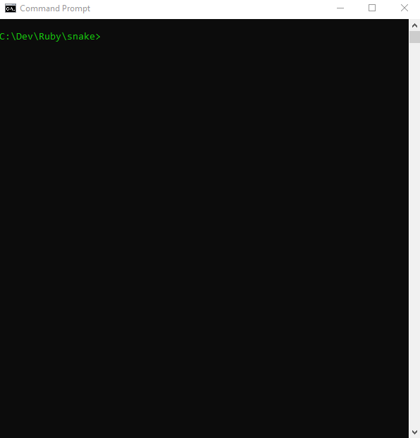

# README

## Description
Snake is a game, that needs no introduction. In this case it's written in Ruby, using Ruby 2D library



## Installation

To install Ruby 2D fremework look [here](http://www.ruby2d.com/learn/get-started/).


## Run the app
```
ruby main.rb
```
